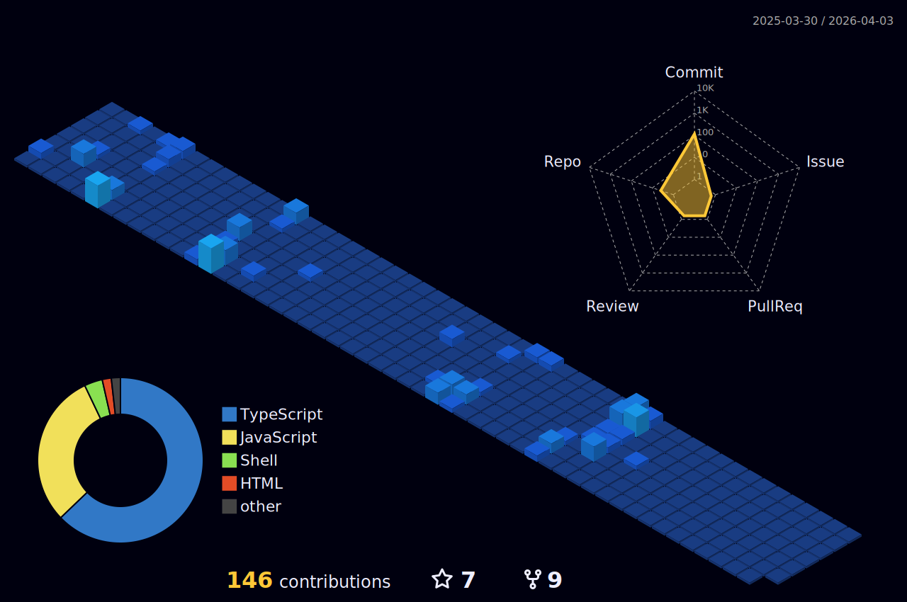

  

- 🔭 I’m currently working on **JavaScript , firebase**

- 🌱 I’m currently learning **Java , python , Django**

- 💬 Ask me about **c++ ,git and c, JS**

- 📫 How to reach me **amlaninisarg15@gmail.com**

## 🌐 Socials:

## 🧑‍💻Programming Platfroms Profile:

## 💻 Tech Stack:
      

## My Favourite IDE

## 🐧Favourite Distros :

## My project Repository :
[To - do list](https://github.com/Nisarg155/task-manager-project) 
[Tetris Game](https://github.com/Nisarg155/Tetris-Game)
 
[Chess Game](https://github.com/Nisarg155/Chessgame)
 
 

&nbsp;

